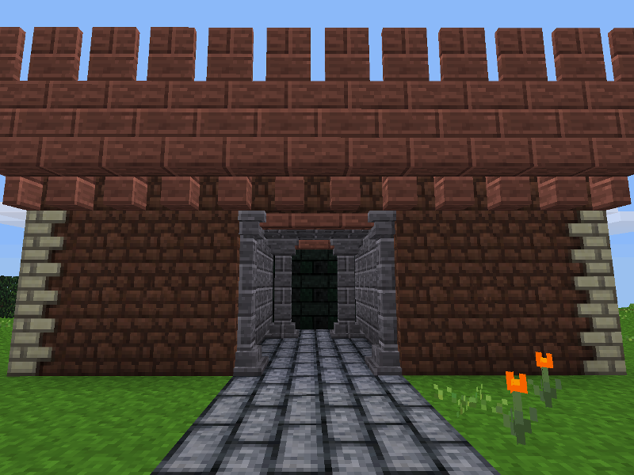

## Castle Masonry

by: Philipbenr, DanDuncombe, FaceDeer

This is a mod all about creating castles and castle dungeons. Many of the nodes are used for the outer-walls or dungeons.

**Licence:** [MIT](LICENSE)

**ContentDB:** [FaceDeer/castle_masonry](https://content.luanti.org/packages/FaceDeer/castle_masonry/)

### Features

* Walls, Corner-walls,
* Castlestone Stairs, Slabs, and Pillars
* Arrowslits and embrasures
* Rubble (to fill the interior of thick castle walls)
* Murder holes and machicolations
* Pillars and crossbraces
* Roof slate
* Paving stone
* Dungeon stone

Mod settings can allow for the basic castle masonry forms to be made for the following material types (all optional):

* Cobble
* Desert stone
* Desert stone brick
* Sandstone
* Sandstone brick
* Desert Sandstone
* Desert Sandstone brick
* Silver Sandstone
* Silver Sandstone brick
* Stone
* Stone brick
* Castle wall
* Wood
* Snow
* Ice
* Obsidian Brick
